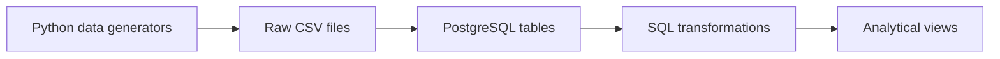

# DutchBank Data Warehouse

## Project Overview

DutchBank Data Warehouse is a portfolio data engineering project built using PostgreSQL and SQL.

The project simulates a banking data environment containing customers, branches, merchants, accounts, currencies, and financial transactions.

The goal of the project is to demonstrate practical data engineering skills, including:

- Relational database design
- SQL data loading
- Table relationships and foreign keys
- Data validation
- SQL joins
- Aggregations and transformations
- Analytical views
- Data quality considerations
- Reproducible database workflows

## Technologies

- PostgreSQL
- pgAdmin 4
- SQL
- CSV
- Git / GitHub

## What This Project Demonstrates

This project demonstrates practical experience with:

- Designing a relational database structure
- Working with primary and foreign keys
- Loading CSV source data into PostgreSQL
- Writing SQL queries using joins, aggregations and conditional logic
- Creating analytical views for reporting and analysis
- Validating data relationships and transaction logic
- Generating reproducible synthetic source data with Python
- Organising a data engineering project using Git and GitHub

## Database Structure

The database contains six related tables:

| Table | Description |
|---|---|
| `customers` | Customer information |
| `branches` | Bank branch information |
| `merchants` | Merchant information and categories |
| `currencies` | Supported currencies |
| `accounts` | Customer bank accounts and account status |
| `transactions` | Financial transactions linked to accounts and, where applicable, merchants |

### Relationships

The main relationships between the tables are:

- One customer can have multiple accounts.
- Each account belongs to one customer.
- Each account belongs to one branch.
- Each account can have multiple transactions.
- A transaction can optionally be linked to a merchant.
- Transactions reference a currency through `currency_code`.

### Pipeline Overview


## Data Pipeline

The project follows a simple data pipeline:

1. Raw banking data is provided as CSV files.
2. CSV data is loaded into PostgreSQL tables.
3. Relationships between the tables are defined using primary and foreign keys.
4. SQL is used to validate and transform the data.
5. Analytical views are created to make the data easier to analyse.

### Analytical Views

The project currently includes four SQL views:

| View | Purpose |
|---|---|
| `customer_transaction_summary` | Summarises transactions and spending by customer |
| `merchant_transaction_summary` | Summarises completed purchases by merchant |
| `account_transaction_summary` | Summarises transactions by bank account |
| `transaction_detail` | Combines transaction, account, customer and merchant information into a detailed analytical dataset |

## Example SQL Analysis

The project can be used to answer questions such as:

- Which transaction types have the highest total completed transaction value?
- Which merchants have the highest completed purchase amounts?
- How many transactions are associated with each customer or account?
- Which transactions do not have an associated merchant?

Example query:

```sql
SELECT
    transaction_type,
    COUNT(*) AS transaction_count,
    SUM(amount) AS total_amount
FROM transactions
WHERE status = 'Completed'
GROUP BY transaction_type
ORDER BY total_amount DESC;
```
## Data Validation

The loaded data was validated using SQL queries to check:

- Row counts for each table
- Relationships between customers, accounts and transactions
- Transaction types and statuses
- Transactions with and without associated merchants
- Aggregated transaction amounts
- Customers and accounts with no transactions

The final dataset contains:

| Table | Rows |
|---|---:|
| `customers` | 10 |
| `branches` | 5 |
| `merchants` | 15 |
| `currencies` | 4 |
| `accounts` | 15 |
| `transactions` | 50 |

The validation process also confirmed that transactions without a merchant are valid for transaction types such as deposits, transfers, withdrawals and direct debits, while purchases are associated with merchants.

## Project Structure

```text
DutchBank-Data-Warehouse/
│
├── data/
│   └── raw/
│       ├── accounts.csv
│       ├── branches.csv
│       ├── currencies.csv
│       ├── customers.csv
│       ├── merchants.csv
│       └── transactions.csv
│
├── python/
│   ├── generate_all.py
│   ├── generate_accounts.py
│   ├── generate_branches.py
│   ├── generate_currencies.py
│   ├── generate_customers.py
│   ├── generate_merchants.py
│   └── generate_transactions.py
│
├── sql/
│   ├── schema.sql
│   ├── load_data.sql
│   ├── create_views.sql
│   └── transformations/
│       ├── account_transaction_summary.sql
│       ├── customer_transaction_summary.sql
│       ├── merchant_transaction_summary.sql
│       └── transaction_detail.sql
│
├── data_dictionary.md
├── project_requirements.md
├── README.md
└── .gitignore
```
## How to Run the Project

### 1. Generate the source data

From the project root, run:

```powershell
py python/generate_all.py
```
This generates the six CSV files in `data/raw/`.

### 2. Create the PostgreSQL database

For a new setup, create a PostgreSQL database named `dutchbank`.

The existing project database does not need to be recreated if it is already available.

### 3. Create the database tables

Run `sql/schema.sql` to create the tables and their primary and foreign key relationships.

### 4. Load the source data

Run `sql/load_data.sql` from the project root using `psql`.

This loads the generated CSV files into the PostgreSQL tables.

### 5. Create the analytical views

Run `sql/create_views.sql` to create the project's analytical views.

The resulting views are:

- `customer_transaction_summary`
- `merchant_transaction_summary`
- `account_transaction_summary`
- `transaction_detail`